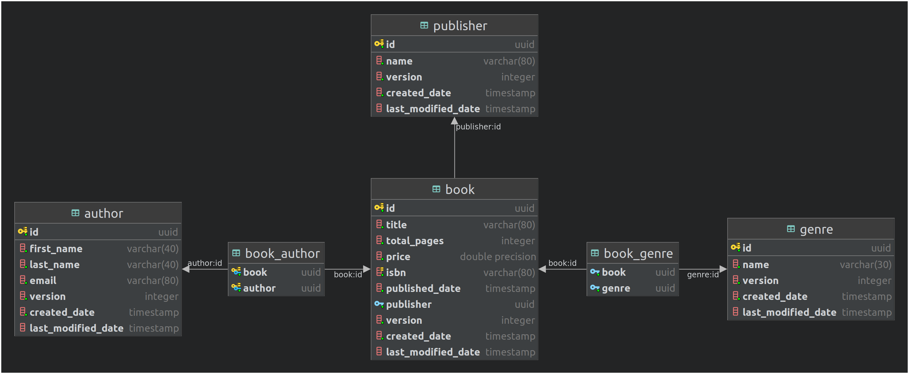

# Dynamically Control JPA Relationships from an HTTP Request.


JPA relationships can be defined as eager or lazying loading. Jpa will automatically load entities in a lazy relationships when you try to access them. But can we trigger the loading, and inclusion of the entity's relationships from the api request? For example, lets say we have a Book entity, which has a many-to-many relationship to the author entity. The request to retrieve a book would look like this.

`GET server:port/api/book/{bookid}`

This is the SQL that is generated to retrieve a single book from the database.

```sql
select bookentity0_.id                 as id1_1_0_,
       bookentity0_.created_date       as created_2_1_0_,
       bookentity0_.last_modified_date as last_mod3_1_0_,
       bookentity0_.version            as version4_1_0_,
       bookentity0_.isbn               as isbn5_1_0_,
       bookentity0_.price              as price6_1_0_,
       bookentity0_.publisher          as publishe9_1_0_,
       bookentity0_.title              as title7_1_0_,
       bookentity0_.total_pages        as total_pa8_1_0_
from book bookentity0_
where bookentity0_.id = ?
```

This will only return the book entity. But what if we wanted to retrieve the authors for this book within the same request, how could we do that? Let's add a request parameter to the url.

`GET server:port/api/book/{bookid}?expand=authors`

For this to work, we have to make a few modification... 

1. Define which properties are expandable in the repository configuration class. In this example, I'm using the JPA metamodel to get type safe references to entity properties, but you could also pass in string values.

```java
@Configuration
public class RepositoryConfig {
	@Bean
	public GraphBuilder<BookEntity> bookEntityGraphBuilder() {

		return GraphBuilder.builder(BookEntity.class)
			.addProperty(BookEntity_.authors)
			.addProperty(BookEntity_.publisher)
			.addProperty(BookEntity_.genres)
			.build();
	}
}
```
The GraphBuilder for the BookEntity is defined as a bean, so you can easily autowire it into your service providers.

2. Within the call to the JPA repository, call the createResolver method on the GraphBuilder object that we just configured in the last step. 
 
```java
public BookDto getBook(UUID id, @Nullable String expand) {
	return new BookDto(
	    bookRepository.findById(id, bookGraphBuilder.createResolver(expand))
	).orElseThrow();
}
```

The createResolver method takes a string of comma delimited properties, and converts it into a EntityGraph that the jpa repository can use to generate the required SQL. It can resolve multiple properties at once, and it is not limited to a single level within the entity graph.

So now, this request: `GET server:port/api/book/{bookid}?expand=authors`, generates the follow SQL.

```sql
select bookentity0_.id                 as id1_1_0_,
       bookentity0_.created_date       as created_2_1_0_,
       bookentity0_.last_modified_date as last_mod3_1_0_,
       bookentity0_.version            as version4_1_0_,
       bookentity0_.isbn               as isbn5_1_0_,
       bookentity0_.price              as price6_1_0_,
       bookentity0_.publisher          as publishe9_1_0_,
       bookentity0_.title              as title7_1_0_,
       bookentity0_.total_pages        as total_pa8_1_0_,
       authors1_.book                  as book1_2_1_,
       authorenti2_.id                 as author2_2_1_,
       authorenti2_.id                 as id1_0_2_,
       authorenti2_.created_date       as created_2_0_2_,
       authorenti2_.last_modified_date as last_mod3_0_2_,
       authorenti2_.version            as version4_0_2_,
       authorenti2_.email              as email5_0_2_,
       authorenti2_.first_name         as first_na6_0_2_,
       authorenti2_.last_name          as last_nam7_0_2_
from book bookentity0_
         left outer join book_author authors1_ on bookentity0_.id = authors1_.book
         left outer join author authorenti2_ on authors1_.author = authorenti2_.id
where bookentity0_.id = ?
```

To implement this feature in a project, requires the following classes.

- [EntityGraphRepository](./src/main/java/net/digitallogic/PropertyExpander/persistence/repository/factory/EntityGraphRepository.java): Any repository that you want to support this feature, needs to extend this interface.
- [AdvancedJpaRepository](./src/main/java/net/digitallogic/PropertyExpander/persistence/repository/factory/AdvancedJpaRepository.java): This is the concrete base class that all jpa repositories are instanced from. This class knows how to take a GraphResolver, convert it into a EntityGraph, and apply it to a TypedQuery, to generate the required SQL.
- [GraphBuilder](./src/main/java/net/digitallogic/PropertyExpander/persistence/repository/factory/GraphBuilder.java): Builds a graph resolve, and entity graph for each jpa entity. This class does most of the heavy lifting.
- [RepositoryConfig](./src/main/java/net/digitallogic/PropertyExpander/config/RepositoryConfig.java): Define and create a GraphBuilder bean for each jpa entity that you want to support this feature.
- Finally, config the AdvancedJpaRepository to override the SimpleJpaRepository within your repository configuration. There are two different ways to do this. In both cases you have to add the @EnableJpaRepositories annotation to a configuration class.
  - You can set the repository base class directly: `@EnableJpaRepositories(repositoryBaseClass=AdvancedJpaRepository.class)`
  - Or define a repositoryFactoryBeanClass to set the repository base class: `@EnableJpaRepositories(repositoryFactoryBeanClass = RepositoryFactoryBean.class)`
  
You could also use fragment composition to inject the required implementation into the JPA repository, the choice is yours. 

A fully functioning example [project](https://github.com/Digital-Logic/PropertyExpander) is available at GitHub. Checkout the [readme](./ReadMe.md) for this project for more information. 
The database struct for this project is:




