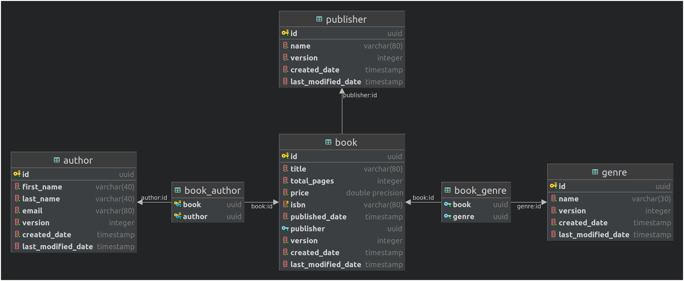

# PropertyExpander Sample

This is a sample projected that demonstrates how to dynamically load entity relations through a request parameter. For an example.

`GET server:port/api/book/{id}?expand=authors`

### Getting Started
Start up the postgres server by running.
```
docker-compose up -d
```

Create the database tables, and generate fake data.
```
./gradlew flywayMigrate
```

Build the application
```
./gradlew build
```

Finally, run the application
```
./gradlew bootRun
```

The api will listen on port 4000.

### API Endpoints

| URL | METHOD | URL Params                           | Expand Properties |
| ----|--------|--------------------------------------| --------------    |
| /api/book | GET | page=0, limit=25, sort=title, expand | authors, genres, publisher |
| /api/book/{id} | GET | expand | authors, genres, publisher |
| /api/author| GET | page=0, limit=25, sort=lastName,firstName, expand| books |
|/api/author/{id} | GET | expand | books|
|/api/genres | GET | page=0, limit=25, sort=name, expand| books |
|/api/genres/{id} | GET | expand | books |
|/api/publisher | GET | page=0, limit=25, sort=name, expand| books |
|/api/publisher/{id} | GET | expand | books |

The database structure for this project is:
